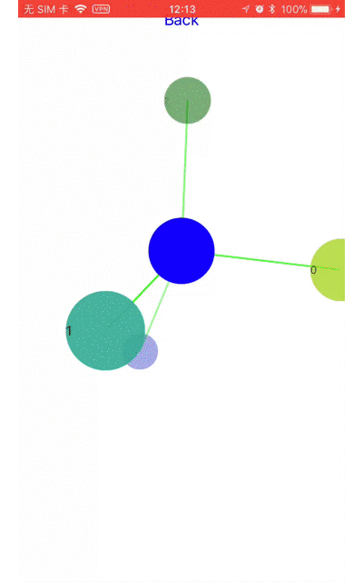

# AISphereView

[](https://travis-ci.org/mayqiyue/AISphereView)
[](http://cocoapods.org/pods/AISphereView)
[](http://cocoapods.org/pods/AISphereView)
[](http://cocoapods.org/pods/AISphereView)

## Purpose
I like to realize UI effects when I am free. The AISphereView was inspire by [QQ Browser](https://itunes.apple.com/cn/app/qq%E6%B5%8F%E8%A7%88%E5%99%A8-%E5%BD%95%E8%A7%86%E9%A2%91%E7%A7%80%E5%87%BA%E4%BD%A0%E7%9A%84%E7%B2%BE%E5%BD%A9%E7%9E%AC%E9%97%B4/id370139302?mt=8). 

### Here is the proto effect:     


### And here is AISphereView:    



## Example
You can clone or download the example to have fun with it.

To run the example project, clone the repo, and run `pod install` from the Example directory first.

## Installation

AISphereView is available through [CocoaPods](http://cocoapods.org). To install
it, simply add the following line to your Podfile:

```ruby
pod 'AISphereView'
```
## Usage

The API is very easy to use:

    - (void)pushToCenter:(UIView *)centerView withItems:(NSArray <UIView *>*)items;

    - (void)popToCenter:(UIView *)centerView withItems:(NSArray <UIView *>*)items;
    
### PS: 
1. For saving memory. AISphereView will not hold 'items' when '- (void)pushToCenter:(UIView *)centerView withItems:(NSArray <UIView *>*)items' gets called. 
2. You need use a stack to manager the data yourself when push. (Example project for your reference)

## Author

mayqiyue, xu20121013@gmail.com

## License

AISphereView is available under the MIT license. See the LICENSE file for more info.
